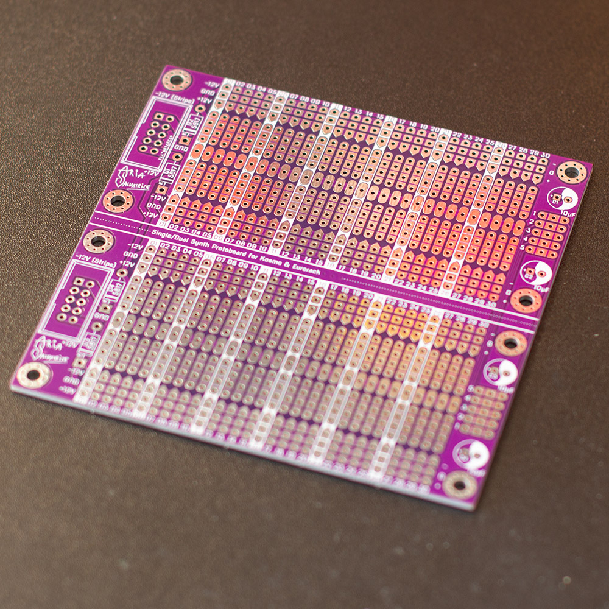
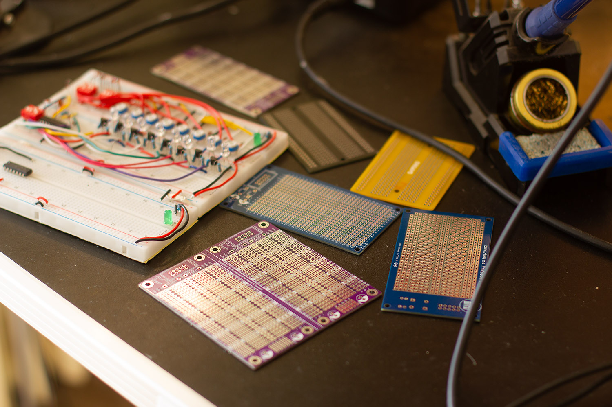
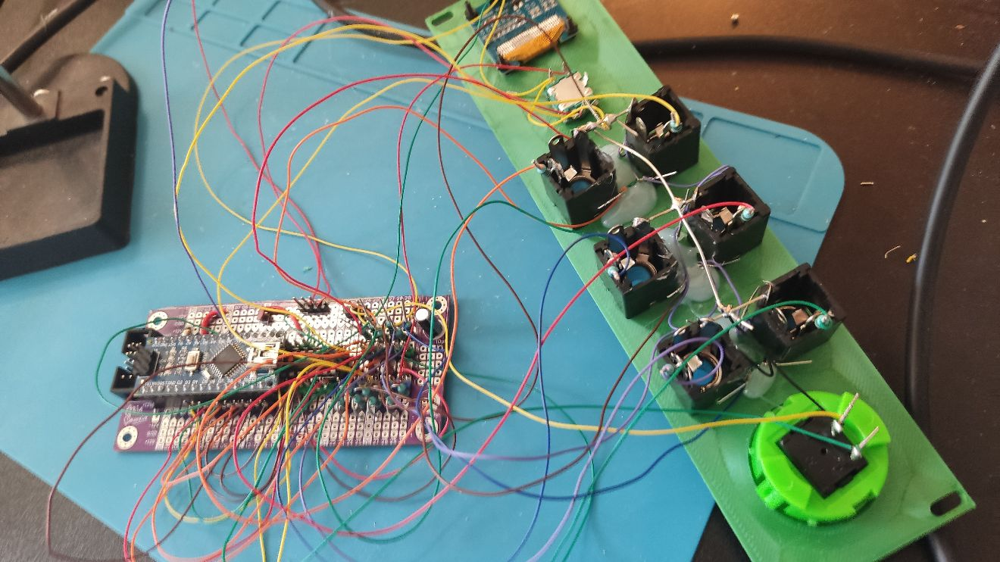
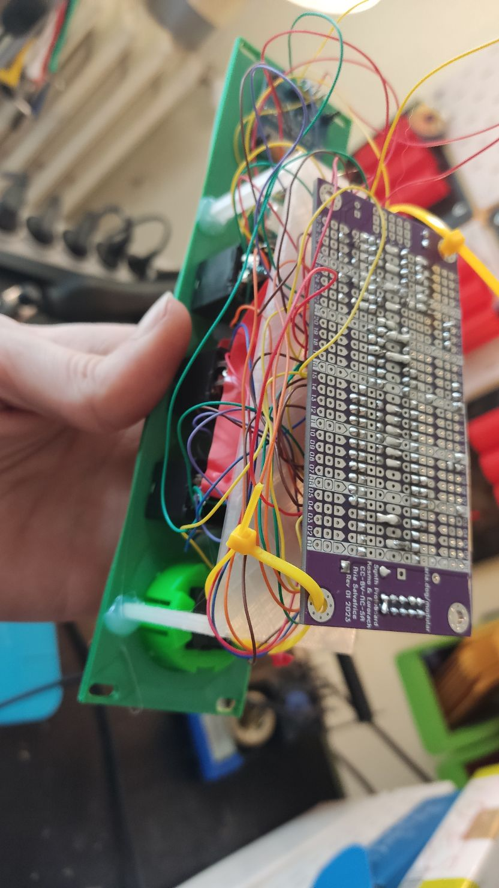
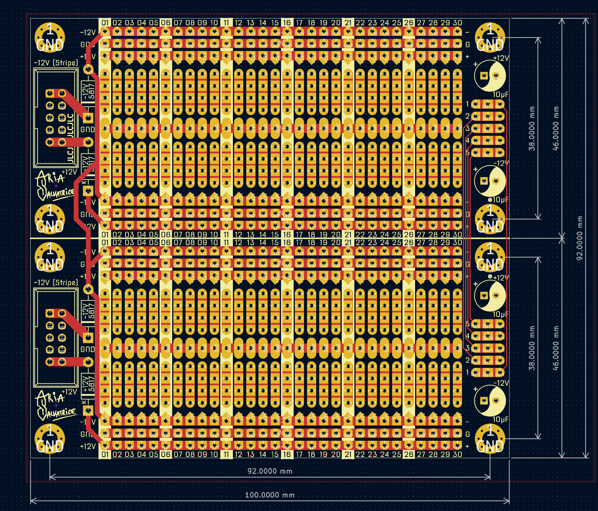
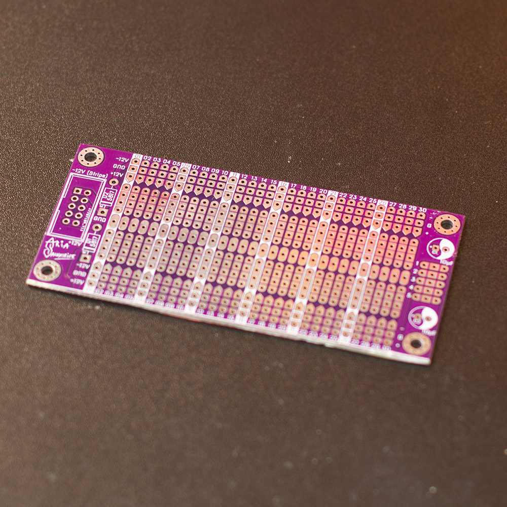

# Prototype board for Kosmo & Eurorack
Hey what's hip love, welcome to my twisted atelier. When making some honking diy synths I really like prototype PCBs with a breadboard layout. You can tinker with the circuit with a real breadboard, then solder a one-off build with almost the same layout. And it turns out, having such PCBs printed with custom features can be even cheaper than buying generic ones—especially if you manage to cram two of them into a small size! So I designed a protoboard with convenient features for DIY synthesizers that require three power rails. You can use both halves or cut it in two manually. 

Latest revision: 2    
Latest fully tested revision: 1 (depicted in the photos)

License: [CC-BY-NC-SA 4.0](https://creativecommons.org/licenses/by-nc-sa/4.0/). You can edit them, but you can't sell them. 

On the picture above, you can see some plastic breadboards, my PCB in purple (both intact and cut in half), generic ones from Aliexpress, and [Analog Output's protoboards](https://github.com/holmesrichards/Protoboard) in blue, whose project inspired mine.

Wanna see them in use?

 

Note that I build in the Kosmo format, which is 5U, larger than Eurorack's 3U, but electrically pretty much identical. I like to pair the boards with pin headers and wire wrapping, for even easier construction.

## Dimensions

(Revision 2 depicted above—Rev 1 was 4mm taller)

- 100×92 when intact (small enough to get a special deal from some fabs)
- 100×46 when cut in the center: it can fit parallel to a 10hp Eurorack module, or a 50mm Kosmo module.
- Grounded M3 mounting holes, center 4mm away from each edge

## Features
- You can cut it in half or use it intact
- Two half-breadboard layouts, 30 columns each, with a two groups of four pads, spaced to add DIP IC in the center
- Three power rails, easily connected via solder bridges to cut down on wiring: each group of pads can be solder bridged to the ground (running in the center) and either the +12V or the -12V rail. Lay out your components to take advantage of this!
- Uses Eurorack 10-pin connectors, with space for shrouded headers (you can also use normal pin headers, but they won't protect you from plugging in the cable wrong)
- Reverse polarity protection via 1N5817 diodes (please only substitute them for something else if you 100% know what you're doing)
- Space for electrolytic capacitors for decoupling. Populating those footprints is optional. Can't go wrong with 10µF, but you know best what your project needs.

## Using it intact
When using the PCB intact, you only need to populate one of the two power header footprints, the diode footprints on the same half, and the decoupling capacitors on either half. 

Note that in the default configuration, using reverse current protection diodes, the two power headers do not connect to each other: you can't populate both to daisy-chain power.

To the right of each half, you will see 5 groups of 3 linked pads that you can use as you wish. The pads on the top half of the board are connected to the pads on the bottom half, but bear in mind the traces are thin (so only route low-current signals), and their vertical order is reversed on each half.

## Cutting them in half
It's designed to let you do that! However, there is no V-scoring making them easy to snap in half: you have to cut them yourself. Adding a V-score would add a lot to the cost, and it would no longer be possible to have electrical connections between halves. 

**PCB dust is some of the nastiest stuff you could put in your lungs. Only cut and sand down PCBs while wearing a proper respirator in a well-ventilated area.**

You have two options:

- **Score and snap**: using a ruler and a strong sharp utility knife, score the center line dozen of times on both sides, then snap the board in half. With a thin box cutter, it will take a lot of scoring before you reach the necessary depth. It should snap efforlessly: if it takes force, score it more. **This will generate some dust.**
- **Saw it in half**: you can use a rotary tool with a cut-off wheel, for example. **This will generate huge amounts of dust.**

After that you will probably want to sand down the sharp edge, just a few rubs with coarse sandpaper will do. **This will generate a lot of dust.**

Dispose of the PCB dust. Or just snort it, whatever, I'm not your mom.

There is confusion whether fab houses allow a cheapskate design like mine, and it seems to be a bit of a gamble whether your reviewer will accept a board like this, [JLCPCB says you're allowed to do this for small orders](https://jlcpcb.com/quote/pcbOrderFaq/Different%20Design%20in%20Panel) in some pages of their documentation, but also says you're not allowed to do it on other pages, so ¯\\\_(ツ)_/¯       
If your reviewer refuses it, maybe try contacting support and show them this page? 

## Bonus Protip
When working with a circuit that doesn't require a -12V rail at all, you can skip the corresponding diode and decoupling capacitor, and use the -12V rail to route what you want instead. For example, working with an Arduino Nano project, I used the -12V rail to route the +5V rail coming from its voltage regulator instead.

## Ordering
I do not currently sell PCBs: you will have to order them directly from a fab house. But don't be intimidated, it's pretty simple to do that.

I use JLCPCB, mostly because they take care of European import duties, making them the cheapest option for me to order from France (7 euros for 5 boards, shipped). But be sure to shop around! You specifically want a fab house that cuts you a good deal for a small quantity of boards under 100×100mm.

While their order form is intimidating, you can simply accept all the default settings. But here's three settings to consider changing:

- **PCB Color** because who would be caught rocking green in TYOOL 23
- **Surface finish**: by default, the boards have lead, you may prefer to go lead-free for a small surchage
- For JLCPCB: **Remove Order Number - Specify a location**. By default, fab houses will slap an order number somewhere random on your board, but you can tell JLCPCB where to put it if you add the text "JLCJLCJLCJLC" somewhere on your board. The text is already included in both KiCad project files and gerber exports, so if ordering with JLCPCB, you just have to select it, and the number will be concealed under the power header. The text is already included in the KiCad project files. 

Leave the **Different Design** setting to the default of 1.

Note that in JLCPCB's viewer, sometimes, the drill holes do not appear for some reason, but rest assured those Gerbers worked just fine with their systems. If that's the case for you, maybe try leaving a note to the reviewer saying "I did not see the holes on your online gerber viewer, please cancel the order if there are no holes".

## Editing the files
This project is for KiCad 7. You will need the [Nova font family](https://www.fontspace.com/nova-font-f17174) by Wojciech Kalinowski to edit the PCBs. You will also get errors that my footprint library is missing, but it won't cause any issue.

## Big scary warnings
First, this is my first PCB (soft and mostly unannounced) release, I'm trying to have pro docs but it's still an amateur hour job. I hope you will find it useful, but you use it as your own risk. I'm so new at this I have yet to even put any sort of content at the URL I printed out on the boards.

Second, I have only received prints of Revision 1 so far. Revision 2 is almost identical, but if you order it, it hasn't been tested yet. You will find the files for Revision 1 in the history of this repository.

## Licensing: Understanding the "Non-Commercial" rule
**You cannot sell this item, but you can share it with your community if you don't profit from it.**

I do not want to have to compete against low quality products bearing my own name in the event I choose to sell products in the future. I disallow commercial usage via the  [CC-BY-NC-SA 4.0](https://creativecommons.org/licenses/by-nc-sa/4.0/) license.

Ordering PCBs of my project from a fab house with a minimum order of 5, and selling the 4 leftover PCBs at cost in a DIY community, that's fair. But ordering 20 PCBs of my project and selling them for profit on a marketplace like Reverb or eBay is forbidden.

## Licensing: Using the Aria Salvatrice logo/signature
**I do not sign things I did not make. Never use my signature in ways that imply my participation or my endorsement**.

Do not put my signature on a customized PCB. If shoddy mods I didn't design myself display my signature, it makes it harder for me to establish a reputation for quality.

If you are modifying my PCB, remove the signature graphic before you redistribute it, and credit me in a more appropriate way: for example, add text that says "Based on a design by Aria Salvatrice" in the docs and on the PCB. 

## Changelog 

- 2023-02-18: **Revision 1**. Ordered via JLCPCB and received 2023-03-02. Confirmed to work as expected.
  - Initial design
- 2023-03-10: **Revision 2**. Ordered 2023-03-11 and received 2023-03-23. Quickly but not thoroughly tested.
  - Added project documentation
  - Labeled the power rails on the back of the board
  - Altered the silkscreen of the capacitors a little
    - Made the + symbols bigger (they were too small for proper disambiguation)
    - Made the yin 'n yang symbol more obvious. This is gonna be one of my PCB signature moves. Deal.
    - Labeled which capacitor corresponds to which rail (+12V or -12V)
  - Removed the 4mm gap between boards: I thought they'd make it easier to cut the board, but it's the other way around, it's impossible the cut out the 4mm lip via the score and snap method.

## Contact

I'd love to see the stuff you make with those boards! You can send me pics of your contraptions and dog gifs at [woof@aria.dog](mailto:woof@aria.dog). I'm also on the Fediverse (Mastodon-compatible): [@woof@aria.dog](https://fedi.aria.dog/woof).

toodles, 

